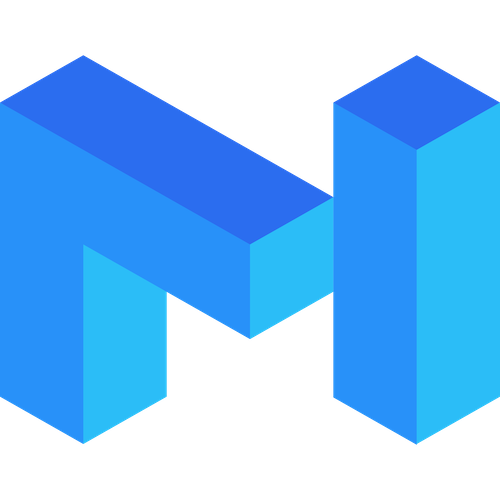
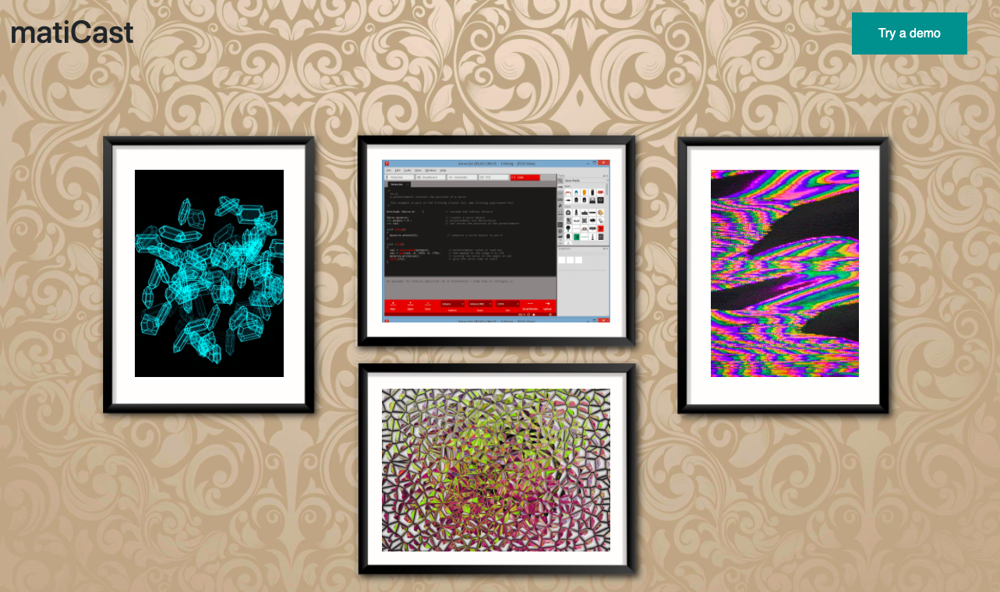
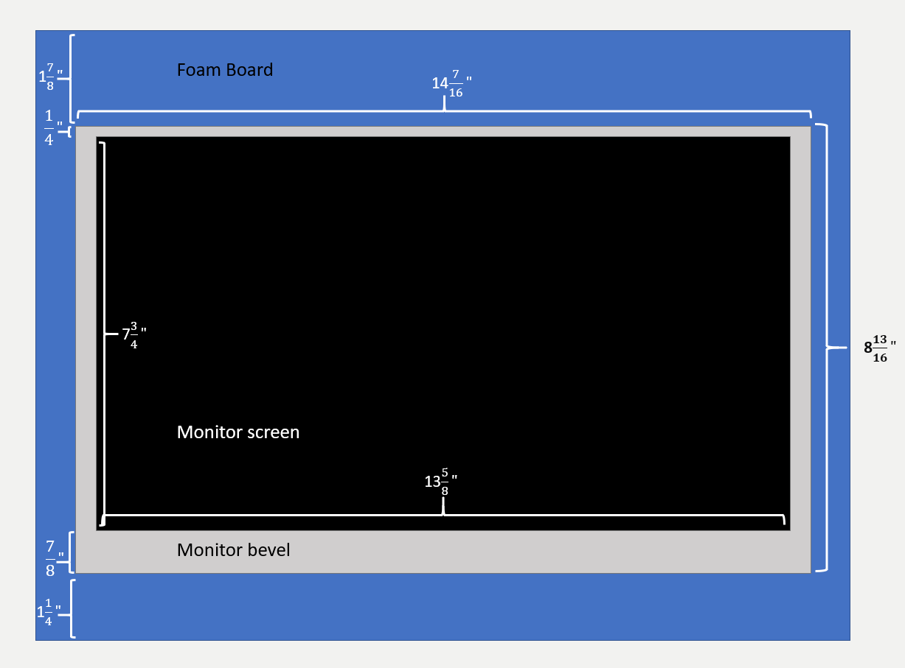
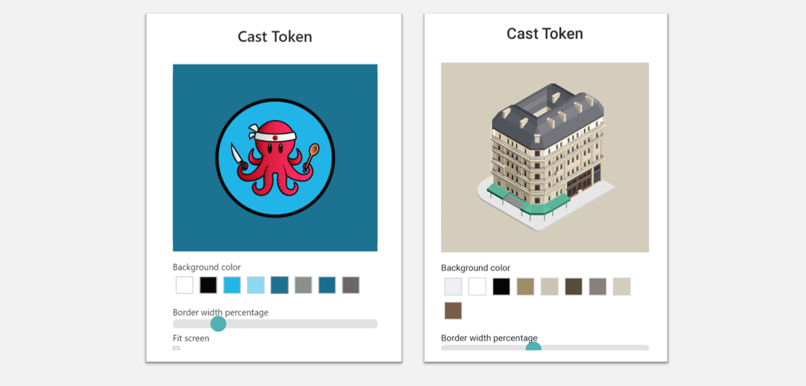

# matiCast

> DIY Web + Hardware NFT Art Display using Matic Network 🧥 🗄️ 👊



### What is matiCast?
matiCast is a dApp that seamslessly integrates with Matic Network in order to bring more speed, scalabity and efficiency to your NFT-focused art gallery. You can test it out directly in your browser using compatible Web3 extensions, but the real deal here is to get your hands dirty and build your own blockchain-hardware display!

### Ok...but what is it for?
You've probably already seen electronic picture frames around you aunt's house or something like that. Think of matiCast as one of those that you can build yourself, using accessible and easy to use electronics, leveraging the power of Ethereum + Matic to display
your digital art NFTs in real time, by simply logging into your account!

### Do I need to port my NFTs to Matic?
Nope, that's the magic! By using the interface contracts, and also due to Matic's underlying compatibility with EVM, this dApp can check validity and ownership directly from ETH mainet. This means lower (better yet, waaay lower) fees to keep your art gallery running, without the hassle of having to port your NFTs anywhere.

### How do I build one display?
You can follow the detailed explanation over at [this link](https://github.com/canokaue/matiCast/blob/master/instructions/index.md).
But this is the recommended display setup:


### Do I need specific hardware to do that?
Nope, all hardware tutorials are suggestions to help you out. You can use alternative material and builds as you wish, and you can leverage the dApp to demo matiCast directy in your browser.

### Am I stuck with the NFT standard view?
Nope, you can even customize how you want to display your NFTs!


### Contracts deployed
All smart contracts are still deployed on Matic's testnet Mumbai. Plans on porting them over to mainet are currently on hold for the time being, as this is a Proof of Concept.
* [ownable.sol](https://mumbai-explorer.matic.today/address/0xf77465E89d5D9673c13d44AB2Ea28bD34F88992b/transactions) - mainly used to check ownership of the ERC-721 to display.
* [validator.sol](https://mumbai-explorer.matic.today/address/0xf77465E89d5D9673c13d44AB2Ea28bD34F88992b/transactions) - used to validave NFTs.

Check out the official Matic docs for delailed instructions on how to deploy them:
* [remix](https://docs.matic.network/docs/develop/remix)
* [truffle](https://docs.matic.network/docs/develop/truffle) (personally recommended)

#### Dev Dependencies
* matic-cli
* node
* solidity 0.4.24
* truffle/remix
* Visual Studio Mac
* authereum account
* dotNET core
* redis-server (running)

### Setup

```bash
git clone https://github.com/canokaue/matiCast
cd matiCast
source install.sh
# if Windows run .exe found in matiCastWebApp/bin or /debug
# depends on you VS build config
# if Mac open VSMac and build locally
```

### Config

Required settings (=example):
* CLIENT = "matiCast0"
* ENVIRONMENT = "stable"
* API_KEY = "1hu8is1278s8da9"
* API_SECRET = "AHNG62SG379F32DSAVWSPFUNDUDZIIFSLJEAIUQUHLCG..."
* TIMEZONE = "America/Sao_Paulo"

Available settings (= std_value):
* SAVE_LOGS = False
* LOG_DIR = "logs/"
* MAX_LOG_SIZE = 100000000 # 100Mb